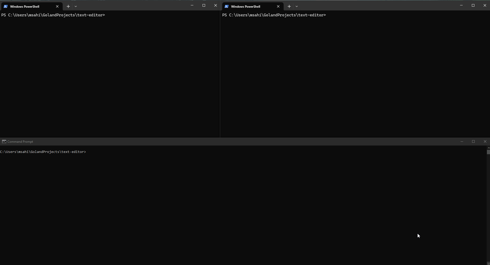

<h2>Real-Time Collaborative Text Editor</h2>



<h3>Overview</h3>

This project is a real-time collaborative text editor that allows multiple users to edit a document simultaneously. It uses WOOT CRDT (WithOut Operational Transformation) for conflict-free editing, ensuring consistent document state across distributed users.

Features
Real-time collaboration: Multiple users can edit the same document.
Conflict-free: Utilizes the WOOT CRDT algorithm for conflict resolution without the need for a central coordinator.
Terminal-based: Built using Termbox for a command-line interface.
File loading and saving: Easily load and save files within the editor.

Installation
Clone the repository:
```
git clone https://github.com/msahilk/text-editor.git
```

Run a server instance (locally or in the cloud):

```
cd text-editor
./server.exe
```


Connect to the server with one or more clients! You can use the following flags when connecting:
<ul>
<li>-debug: enable debug logging</li>
<li>-file: filename to save from/load to (default save is "editor-content.txt") </li>
<li>-login: choose a custom username when joining</li>
<li>-scroll: enable scrolling in the editor</li>
<li>-server: server address (default port 8080)</li>
</ul>

How It Works
The editor uses WOOT CRDT to ensure that every user's changes are applied consistently, even if they edit the same parts of the document simultaneously. Each character in the document is uniquely identified and can be inserted or deleted without conflicts.
